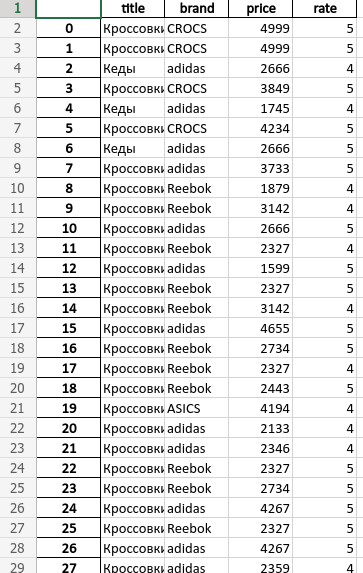

Парсер сайта wildberries  
Проходит по всем товарам по всем страницам  
по url  
Сохраняет в .xlsx файл  
название, бренд, цену, рейтинг  
Пример запуска  
python3 parser.py https://www.wildberries.ru/catalog/obuv/muzhskaya/kedy-i-krossovki result.xlsx  
  
  